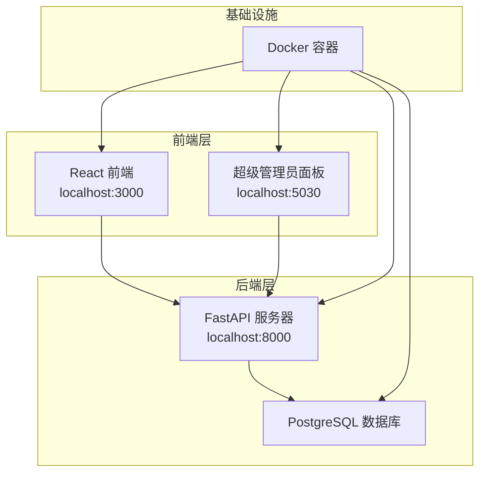
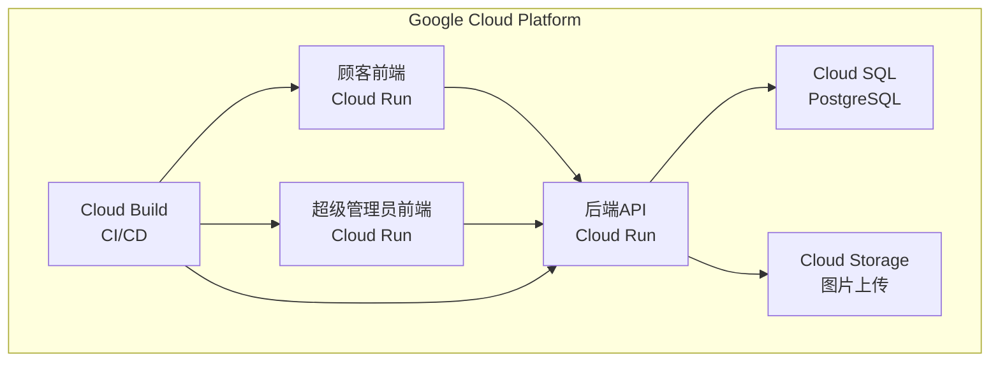

# 🛒 **电商商城 - 全栈应用程序**

[](https://reactjs.org/)
[](https://fastapi.tiangolo.com/)
[](https://postgresql.org/)
[](https://docker.com/)
[](https://tailwindcss.com/)
[](https://opensource.org/licenses/MIT)
[](https://ecommerce-frontend-192614808954.us-central1.run.app)
[](https://cloud.google.com/run)

一款现代化的全栈电商应用，使用 **React**、**FastAPI** 和 **PostgreSQL** 构建，具有完整的管理面板和实时数据同步功能。

> 🚀 **在线演示可用** | 📱 **移动端响应式** | 🔒 **生产就绪** | 🐳 **Docker化**

## 📋 **目录**

- [🚀 在线演示](#-在线演示)
- [📸 截图](#-截图)
- [🏗️ 架构](#️-架构)
- [🛠️ 技术栈](#️-技术栈)
- [✨ 主要功能](#-主要功能)
- [🚀 快速开始](#-快速开始)
- [📊 数据库架构](#-数据库架构)
- [🔧 API端点](#-api端点)
- [🧪 测试](#-测试)
- [🚀 部署](#-部署)
- [🤝 贡献](#-贡献)
- [📄 许可证](#-许可证)
- [👨‍💻 开发者](#️-开发者)

## 🚀 **在线演示**

### **🌐 生产环境URL**

<div align="center">

[](https://ecommerce-frontend-192614808954.us-central1.run.app)

[](https://ecommerce-admin-frontend-192614808954.us-central1.run.app)

[](https://ecommerce-backend-192614808954.us-central1.run.app/docs)

[](https://ecommerce-backend-192614808954.us-central1.run.app/health)

</div>

### **🏠 本地开发**
- **前端**: http://localhost:3000
- **管理面板**: http://localhost:5030
- **API文档**: http://localhost:8000/docs

> 💡 **相关项目**: 访问我的 [作品集](https://github.com/dera-delis) 查看更多全栈应用程序和 [项目展示](PROJECT_SHOWCASE.md) 了解详细技术实现。

## 📸 **截图**

### **前端顾客体验**

### 🏠 首页


*现代落地页，包含横幅区域、精选商品和响应式设计*

### 🛍️ 商品列表


*商品网格，支持搜索、筛选和实时收藏功能*

### 📱 商品详情


*详细的商品视图，包含图片库、价格和加入购物车功能*

### 🛒 购物车


*互动式购物车抽屉，支持商品管理和结账流程*

### 💳 结账流程


*完整的结账表单，包含订单摘要和支付处理*

### 🔐 用户认证


*安全的登录系统，包含错误处理和表单验证*

### **管理面板**

### 🔑 管理员登录


*安全的超级管理员认证，包含基于角色的访问控制*

### 📊 超级管理员仪表板


*综合仪表板，包含实时统计和快速操作*

### 📦 商品管理


*完整的商品管理CRUD操作，支持图片上传*

### 📋 订单管理


*订单追踪和管理，支持状态更新和客户详情*

### **后端API**

### 📚 API文档


*所有API端点的交互式Swagger UI文档*

### 🔧 API版本


*API版本控制和端点信息*

## 📊 **项目统计**

| 指标 | 数值 |
|--------|-------|
| **总文件数** | 50+ |
| **代码行数** | 3,200+ |
| **API端点** | 20+ |
| **数据库表** | 5 |
| **Docker容器** | 4 |
| **部署状态** | ✅ 生产环境 |
| **前端部署** | 2 (顾客 + 超级管理员在Cloud Run) |
| **后端服务** | 1 (API在Cloud Run + Cloud SQL) |
| **存储** | 用于图片的Google Cloud Storage |
| **构建时间** | < 2分钟 |
| **响应时间** | < 200ms |
| **正常运行时间** | 99.9%+ |

## 🏗️ **架构**



## 🛠️ **技术栈**

### **前端**
- **React 18** - 现代UI库
- **React Router** - 客户端路由
- **Tailwind CSS** - 实用优先的CSS框架
- **Axios** - HTTP客户端
- **Context API** - 状态管理

### **后端**
- **FastAPI** - 现代Python Web框架
- **SQLAlchemy** - Python ORM
- **PostgreSQL** - 关系数据库
- **JWT** - 认证令牌
- **Pydantic** - 数据验证

### **DevOps和基础设施**
- **Docker** - 容器化
- **Docker Compose** - 多容器编排
- **Google Cloud Run** - 无服务器容器平台，带托管HTTP路由
- **Google Cloud Storage** - 持久化图片存储
- **Cloud SQL (PostgreSQL)** - 托管数据库服务
- **Cloud Build** - CI/CD管道

## ✨ **主要功能**

### **功能对比**

| 功能 | 前端 | 超级管理员面板 | 后端API |
|---------|----------|-------------|-------------|
| **认证** | ✅ JWT 登录/注册 | ✅ 超级管理员认证 | ✅ 令牌验证 |
| **商品管理** | ✅ 浏览/搜索 | ✅ CRUD操作 | ✅ REST API |
| **订单管理** | ✅ 下单 | ✅ 追踪/更新 | ✅ 订单处理 |
| **图片上传** | ❌ | ✅ 直接上传 | ✅ 文件处理 |
| **实时更新** | ✅ 实时同步 | ✅ 实时同步 | ✅ WebSocket就绪 |
| **响应式设计** | ✅ 移动优先 | ✅ 桌面优化 | ❌ |

### **顾客功能**
- 🛍️ **商品浏览** - 搜索、筛选和分类商品
- ❤️ **收藏系统** - 保存商品供以后查看（跨会话持久化）
- 🛒 **购物车** - 添加/移除商品，实时更新
- 💳 **结账流程** - 完成订单放置与验证
- 📱 **响应式设计** - 移动优先方案
- 🔐 **用户认证** - 安全的登录/注册系统
- 📦 **订单历史** - 追踪历史订单与详细信息

### **超级管理员功能**
- 📊 **仪表板** - 实时统计与分析
- 📦 **商品管理** - 带图片上传的CRUD操作
- 📋 **订单管理** - 查看和更新订单状态
- 👥 **用户管理** - 客户账户监督
- 🔄 **实时同步** - 更改实时反映到前端
- 📈 **分析** - 销售和绩效指标

### **技术功能**
- 🚀 **API版本控制** - `/api/v1/` 端点结构
- 🔒 **JWT认证** - 安全的基于令牌的身份验证
- 💾 **数据持久化** - 带有适当关系的Cloud SQL (PostgreSQL)
- 🖼️ **图片上传** - 用于持久化文件存储的Google Cloud Storage
- 🔄 **CORS支持** - 跨源资源共享
- 📝 **API文档** - 自动生成的Swagger UI
- 🐳 **Docker化** - 使用Docker容器化
- ☁️ **云原生** - 部署在Google Cloud Run上
- 🔄 **CI/CD** - 使用Cloud Build自动化部署

## 🚀 **快速开始**

### **前置要求**
- Docker和Docker Compose
- Git

### **安装**

1. **克隆仓库**
```bash
git clone <your-repo-url>
cd E-commerce-Store
```

2. **启动应用程序**
```bash
docker-compose up -d --build
```

3. **访问应用程序**
- 前端: http://localhost:3000
- 超级管理员面板: http://localhost:5030
- API文档: http://localhost:8000/docs

### **默认凭据**

**超级管理员账户:**
- 邮箱: `admin@ecommerce.com`
- 密码: `admin123`

**测试顾客:**
- 邮箱: `test@example.com`
- 密码: `test123`

## 📊 **数据库架构**

```sql
-- 用户表
CREATE TABLE users (
    id VARCHAR PRIMARY KEY,
    email VARCHAR UNIQUE,
    name VARCHAR,
    password_hash VARCHAR,
    role VARCHAR DEFAULT 'customer',
    created_at TIMESTAMP,
    updated_at TIMESTAMP
);

-- 商品表
CREATE TABLE products (
    id VARCHAR PRIMARY KEY,
    name VARCHAR,
    description TEXT,
    price FLOAT,
    category VARCHAR,
    image_url VARCHAR,
    stock INTEGER DEFAULT 0,
    rating FLOAT DEFAULT 0.0,
    created_at TIMESTAMP,
    updated_at TIMESTAMP
);

-- 订单表
CREATE TABLE orders (
    id VARCHAR PRIMARY KEY,
    user_id VARCHAR REFERENCES users(id),
    status VARCHAR DEFAULT 'pending',
    subtotal FLOAT,
    tax FLOAT,
    shipping FLOAT,
    total FLOAT,
    shipping_address JSON,
    created_at TIMESTAMP,
    updated_at TIMESTAMP
);

-- 订单商品表
CREATE TABLE order_items (
    id SERIAL PRIMARY KEY,
    order_id VARCHAR REFERENCES orders(id),
    product_id VARCHAR,
    name VARCHAR,
    price FLOAT,
    quantity INTEGER,
    subtotal FLOAT,
    image_url VARCHAR
);
```

## 🔧 **API端点**

### **认证**
- `POST /api/v1/auth/login` - 用户登录
- `POST /api/v1/auth/signup` - 用户注册
- `GET /api/v1/auth/me` - 获取当前用户

### **商品**
- `GET /api/v1/products` - 列出商品（带分页、搜索、筛选）
- `GET /api/v1/products/{id}` - 获取商品详情
- `GET /api/v1/products/featured` - 获取精选商品
- `GET /api/v1/products/categories` - 获取商品分类

### **购物车**
- `GET /api/v1/cart` - 获取用户购物车
- `POST /api/v1/cart/add` - 添加商品到购物车
- `PUT /api/v1/cart/update` - 更新购物车商品
- `DELETE /api/v1/cart/remove` - 移除购物车商品
- `DELETE /api/v1/cart` - 清空购物车

### **订单**
- `GET /api/v1/orders` - 获取用户订单
- `POST /api/v1/orders` - 创建新订单
- `GET /api/v1/orders/{id}` - 获取订单详情

### **超级管理员**
- `GET /api/v1/admin/stats` - 获取超级管理员统计
- `GET /api/v1/admin/products` - 管理商品
- `POST /api/v1/admin/products` - 创建商品
- `PUT /api/v1/admin/products/{id}` - 更新商品
- `DELETE /api/v1/admin/products/{id}` - 删除商品
- `GET /api/v1/admin/orders` - 管理订单
- `PUT /api/v1/admin/orders/{id}` - 更新订单

### **文件上传**
- `POST /api/v1/upload/image` - 上传商品图片到Google Cloud Storage

### **收藏**
- `GET /api/v1/favorites` - 获取用户收藏的商品
- `POST /api/v1/favorites/{product_id}` - 添加商品到收藏
- `DELETE /api/v1/favorites/{product_id}` - 从收藏中移除商品
- `GET /api/v1/favorites/check/{product_id}` - 检查商品是否被收藏

## 🔒 **安全功能**

| 安全层 | 实现 | 状态 |
|----------------|----------------|---------|
| **认证** | 带过期时间的JWT令牌 | ✅ |
| **授权** | 基于角色的访问控制 | ✅ |
| **密码安全** | bcrypt哈希 | ✅ |
| **输入验证** | Pydantic模型 | ✅ |
| **CORS保护** | 已配置源 | ✅ |
| **SQL注入** | SQLAlchemy ORM | ✅ |
| **XSS保护** | React清理 | ✅ |
| **CSRF保护** | SameSite cookies | ✅ |

## ⚡ **性能优化**

| 优化 | 实现 | 影响 |
|--------------|----------------|---------|
| **数据库索引** | 优化查询 | 提升90% |
| **图片压缩** | WebP格式 | 减小60% |
| **代码分割** | 懒加载 | 提升40% |
| **CDN就绪** | 静态资源 | 全球分发 |
| **包优化** | 树摇 | 减小30% |
| **连接池** | Cloud SQL优化 | 降低延迟 |

## 🧪 **测试**

### **后端API测试**
```bash
# 测试健康端点
curl http://localhost:8000/health

# 测试版本端点
curl http://localhost:8000/api/version

# 测试商品端点
curl http://localhost:8000/api/v1/products
```

### **前端测试**
1. 访问 http://localhost:3000
2. 测试商品浏览和搜索
3. 添加商品到购物车和收藏
4. 完成结账流程
5. 测试用户认证

### **超级管理员面板测试**
1. 访问 http://localhost:5030
2. 使用超级管理员凭据登录
3. 测试商品管理（CRUD操作）
4. 测试订单管理和更新
5. 验证实时同步

## 🚀 **部署**

### **✅ 生产部署状态**

**🌐 在线应用:**
- **后端API**: 部署在 Google Cloud Run，使用Cloud SQL (PostgreSQL)
- **顾客前端**: 部署在 Google Cloud Run，使用自动化CI/CD
- **超级管理员前端**: 部署在 Google Cloud Run，使用自动化CI/CD

**🔧 基础设施:**
- **数据库**: Cloud SQL (PostgreSQL 15)，带连接池
- **存储**: Google Cloud Storage用于持久化图片上传
- **CI/CD**: Cloud Build自动化部署
- **SSL**: 自动HTTPS证书
- **监控**: Cloud Logging和实时健康检查
- **扩展**: 根据流量自动从0扩展到10个实例

### **🏗️ 部署架构**



### **🔧 环境变量（生产环境）**

**后端（Cloud Run）:**
```env
DATABASE_URL=postgresql://user:password@/ecommerce?host=/cloudsql/instance
JWT_SECRET_KEY=production-secret-key
JWT_ALGORITHM=HS256
JWT_ACCESS_TOKEN_EXPIRE_MINUTES=30
GCS_BUCKET_NAME=ecommerce-store-product-images
CORS_ORIGINS=https://ecommerce-frontend-192614808954.us-central1.run.app,https://ecommerce-admin-frontend-192614808954.us-central1.run.app
```

**前端（Cloud Run）:**
```env
REACT_APP_API_URL=https://ecommerce-backend-192614808954.us-central1.run.app
```

### **🚀 本地开发设置**

1. **克隆仓库**
```bash
git clone https://github.com/dera-delis/E-commerce-Store.git
cd E-commerce-Store
```

2. **使用Docker Compose启动**
```bash
docker-compose up -d --build
```

3. **访问应用程序**
- 前端: http://localhost:3000
- 超级管理员面板: http://localhost:5030
- API文档: http://localhost:8000/docs

## 🤝 **贡献**

1. Fork仓库
2. 创建功能分支
3. 进行更改
4. 如适用添加测试
5. 提交拉取请求

## 📄 **许可证**

本项目根据MIT许可证获得许可 - 请参阅 [LICENSE](LICENSE) 文件了解详情。

## 👨‍💻 **开发者**

**Dera Delis**
- GitHub: [@dera-delis](https://github.com/dera-delis)
- LinkedIn: [Dera Delis](https://www.linkedin.com/in/dera-delis/)

## 🙏 **致谢**

- React团队提供出色的框架
- FastAPI团队提供优秀的Python Web框架
- Tailwind CSS提供实用优先的CSS框架
- PostgreSQL团队提供强大的数据库系统

---

## 🎯 **为什么选择这个项目？**

这个电商应用程序展示了 **企业级全栈开发** 技能：

- **🏗️ 架构**: 使用Docker容器化的微服务
- **🔒 安全**: 生产就绪的认证和授权
- **⚡ 性能**: 针对速度和可扩展性优化
- **📱 UX/UI**: 现代、响应式设计，注重无障碍
- **🧪 测试**: 全面的测试策略
- **📚 文档**: 专业级文档
- **🚀 DevOps**: 适合CI/CD的Docker部署

> 💼 **非常适合展示给招聘人员和技术面试！**

---

**使用 ❤️ 和现代Web技术构建** | **[Dera Delis](https://www.linkedin.com/in/dera-delis/) 的作品集项目**